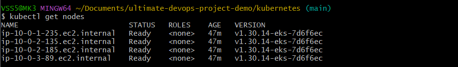
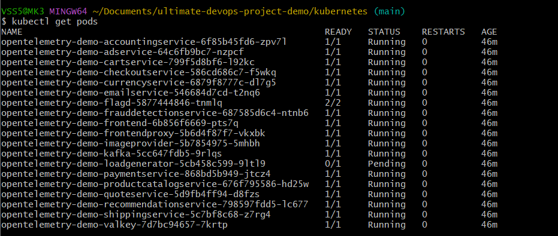
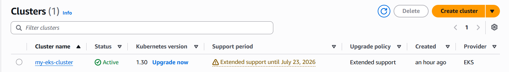
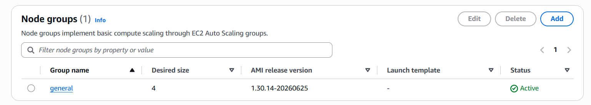
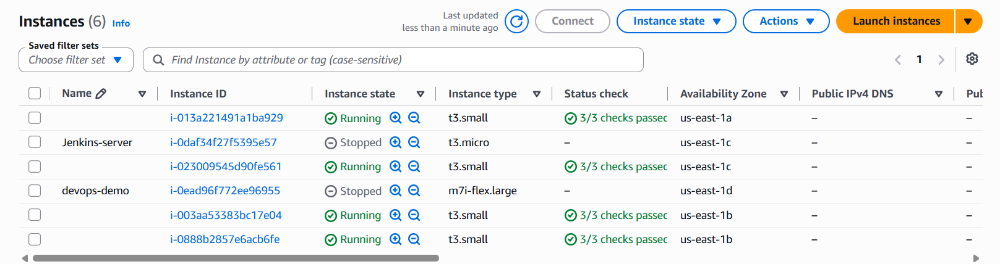
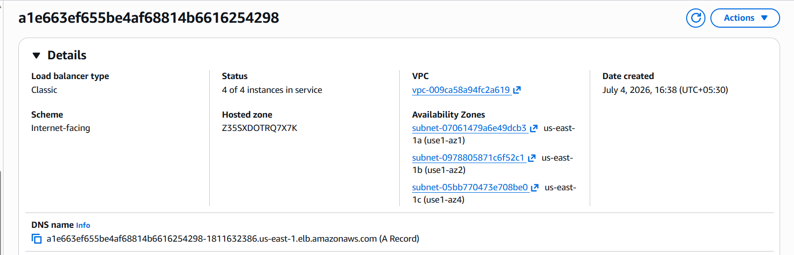
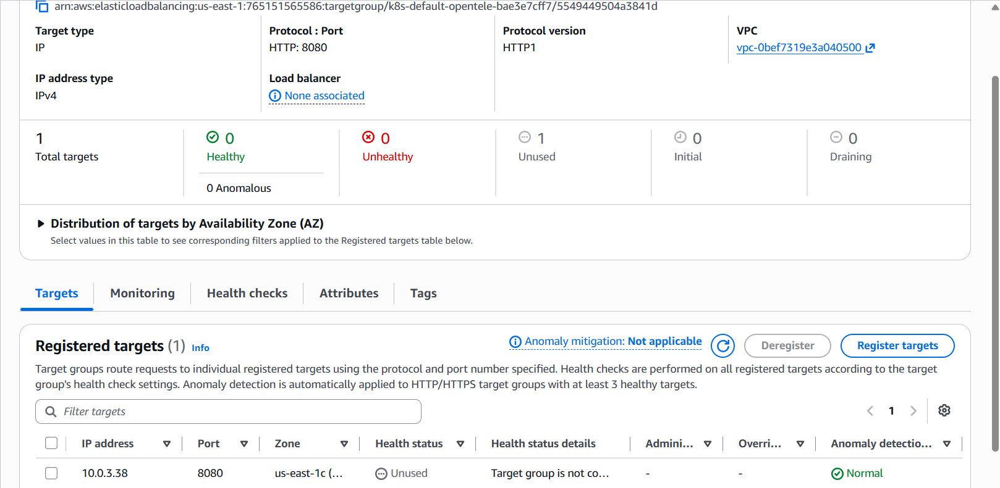
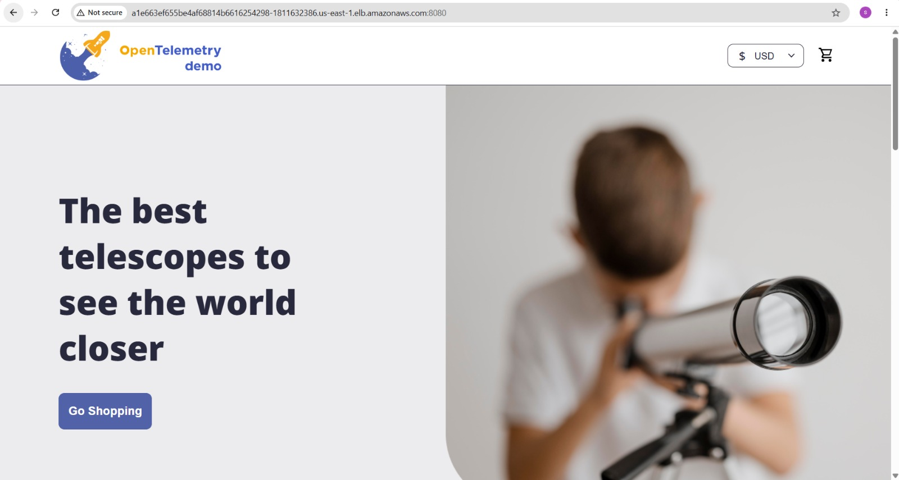

# 🚀 Ultimate DevOps Project on AWS EKS


---

# 📌 Project Overview

This project demonstrates a complete **DevOps deployment pipeline** by deploying a containerized microservices application on **Amazon EKS**. Infrastructure is provisioned using **Terraform**, workloads are orchestrated with **Kubernetes**, containers are managed using **Docker**, and the application is exposed to the internet through an **AWS Load Balancer**.

The project showcases practical cloud infrastructure provisioning, Kubernetes deployment, and cloud-native application management.

---

# ✨ Features

- Infrastructure as Code with Terraform
- Amazon EKS Cluster
- Dockerized Microservices
- Kubernetes Deployments & Services
- AWS Load Balancer Integration
- GitHub Version Control
- Scalable Cloud Infrastructure

---

# 🛠 Tech Stack

- AWS
- Terraform
- Amazon EKS
- Kubernetes
- Docker
- Git
- GitHub
- Linux
- YAML

---

# ☁️ AWS Services Used

- Amazon EKS
- Amazon EC2
- Amazon VPC
- IAM
- Elastic Load Balancer (ELB/ALB)
- Security Groups
- Auto Scaling
- Cloud Networking

---

# 🏗 High-Level Architecture

```text
Developer
    │
    ▼
GitHub Repository
    │
    ▼
Terraform
    │
    ▼
AWS Infrastructure
(VPC + EKS + IAM)
    │
    ▼
Amazon EKS Cluster
    │
    ▼
Kubernetes Deployments
    │
    ▼
Services
    │
    ▼
AWS Load Balancer
    │
    ▼
Internet Users
```

---

# 📂 Repository Structure

```text
ultimate-devops-project/
│
├── kubernetes/
├── src/
├── screenshots/
├── .github/
├── README.md
└── ...
```

---

# 🚀 Deployment Steps

### Clone Repository

```bash
git clone https://github.com/sohamjarad/ultimate-devops-project.git
cd ultimate-devops-project
```

### Deploy Infrastructure

```bash
terraform init
terraform apply
```

### Configure kubectl

```bash
aws eks update-kubeconfig --region us-east-1 --name my-eks-cluster
```

### Deploy Application

```bash
kubectl apply -f kubernetes/
```

### Verify Deployment

```bash
kubectl get pods
kubectl get svc
kubectl get nodes
```

---

# 📸 Project Screenshots

## Kubernetes Nodes



---

## Kubernetes Pods



---

## Kubernetes Services


---

## Amazon EKS Cluster



---

## Node Group



---

## EC2 Worker Nodes



---

## AWS Load Balancer



---

## Target Group



---

## Running Application



---

# 📈 Skills Demonstrated

- Infrastructure as Code (Terraform)
- Amazon EKS Administration
- Kubernetes Deployments
- Docker Containerization
- AWS Networking
- Load Balancer Configuration
- Linux Command Line
- Git & GitHub
- Cloud Infrastructure Management
- Troubleshooting Kubernetes Deployments

---

# 📚 Key Learning Outcomes

- Provisioned AWS infrastructure using Terraform.
- Deployed a production-style application on Amazon EKS.
- Managed Kubernetes workloads and services.
- Configured AWS Load Balancer for external access.
- Practiced Infrastructure as Code and cloud automation.
- Learned cloud resource lifecycle management using Terraform.

---

# 👨‍💻 Author

**Soham Jarad**

- GitHub: https://github.com/sohamjarad
- LinkedIn: _(Add your LinkedIn profile URL here)_

---

⭐ If you found this project helpful, consider giving it a star!
